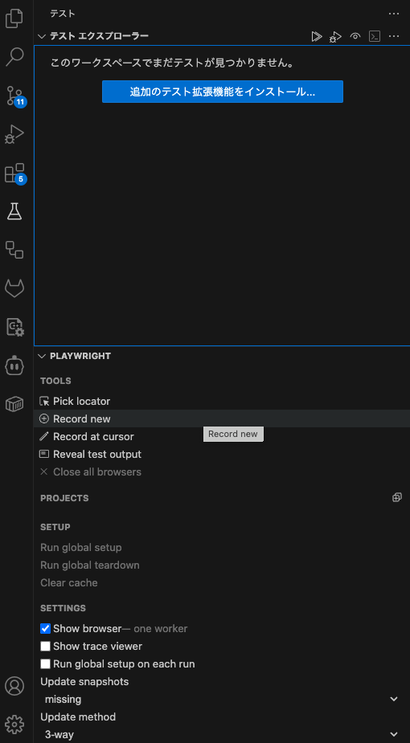

# プロジェクト概要

MablからPlaywrightへのE2Eテストリファクタリング共通基盤プロジェクトです。

## 目的

このプロジェクトは、M3サービス群のE2Eテストを効率的にリファクタリングするための共通基盤とガイドラインを提供します。

## プロジェクト構成

```
playwright-e2e-refactor/
├── .claude/                     # Claude専用設定フォルダ
│   ├── CLAUDE.md               # リファクタリングガイドライン（最重要）
│   └── service/                # サービス固有の設定
│       └── service-test-specs.md  # テスト仕様書
├── shared-e2e-components/       # 共通コンポーネントライブラリ
│   ├── auth/                   # M3認証処理
│   ├── common/                 # ヘッダー・サイドバー・BasePage
│   ├── config/                 # エラー無視設定
│   └── utils/                  # テストヘルパー
└── testcase/                   # Mablテスト原本
```

## 他プロジェクトへの展開手順

### Phase 0: 開発環境のセットアップ(vscodeとclaude codeの設定)

以下の手順はほぼmacOS想定です。

#### Step 1: VSCodeのインストール（推奨）

**macOS**: Self Serviceから「Visual Studio Code」をインストール
**Windows**: タスクランチャーから「Visual Studio Code」をインストール

#### Step 2: GitLabアクセストークンの設定

GitLabからプライベートリポジトリをcloneするために、アクセストークンを設定してください。

- GitLabにログイン: https://rendezvous.m3.com/
- 右上のユーザーアイコン → **Preferences** → **Access Tokens**
- **Add new token** をクリック
- Token name: 任意の名前（例: `playwright-dev-token`）
- Expiration date: 有効期限を設定（推奨: 90日以内）
- Select scopes: `read_repository` と `write_repository` の両方にチェック
- **Create personal access token** をクリック
- 表示されたトークンをコピー（Step6 で使います。⚠️ このページを閉じると二度と表示されません）

#### Step 3: 環境変数の設定

**以下macのターミナル上で操作してください。** まず現在のシェルを確認してください。

```bash
#/bin/zsh or /bin/bash のどちらかが出力されるはず
echo $SHELL
```

以下1行ずつコピーして実行してください。

**zshの場合（/bin/zsh）**:
```bash
echo 'export CLAUDE_CODE_USE_VERTEX="true"' >> ~/.zshrc
echo 'export CLOUD_ML_REGION="us-east5"' >> ~/.zshrc
echo 'export ANTHROPIC_VERTEX_PROJECT_ID="m3staff-aiagent"' >> ~/.zshrc
echo 'export PATH=$PATH:"/Applications/Visual Studio Code.app/Contents/Resources/app/bin"' >> ~/.zshrc
source ~/.zshrc
```

**bashの場合（/bin/bash）**:
```bash
echo 'export CLAUDE_CODE_USE_VERTEX="true"' >> ~/.bashrc
echo 'export CLOUD_ML_REGION="us-east5"' >> ~/.bashrc
echo 'export ANTHROPIC_VERTEX_PROJECT_ID="m3staff-aiagent"' >> ~/.bashrc
echo 'export PATH=$PATH:"/Applications/Visual Studio Code.app/Contents/Resources/app/bin"' >> ~/.bashrc
source ~/.bashrc
```

**⚠️ 重要**: ターミナルを再起動した際は、以下のコマンドで環境変数を再読み込みしてください。
```bash
# zshの場合
source ~/.zshrc

# bashの場合
source ~/.bashrc
```

#### Step 4: claude code CLIのインストール

https://docs.google.com/document/d/16HvLcHWPsDWlP3ySS-SD2pLTOZnsby11syXj_K-pDaw/edit?tab=t.0#heading=h.qnuh0trpkw6f

```bash
# claude code CLIのインストール
brew install node
npm install -g @anthropic-ai/claude-code

# google認証
brew install google-cloud-sdk
gcloud auth login
gcloud auth application-default login
```

#### Step 5: Playwright拡張機能のインストール

VSCode内で `Ctrl+Shift+X` (Mac: `Cmd+Shift+X`) を押し、「Playwright」を検索して **Playwright Test for VSCode** をインストールしてください。
また、左下の歯車設定マークから拡張機能を選択し、インストールしてください。

#### Step 6: このリポジトリをclone

```bash
# macOSの場合、Keychainに認証情報を保存
git config --global credential.helper osxkeychain

# リポジトリをclone
git clone https://rendezvous.m3.com/yuichiro-sueyoshi/playwright-e2e-refactor.git

# 初回clone時にユーザー名とトークンの入力を求められます
# Username: GitLabのユーザー名
# Password: Step 2で作成したアクセストークン
```

### Phase 1: 環境セットアップ

```bash
# cloneしたフォルダ内部に移動
cd playwright-e2e-refactor

# 依存関係のインストール
npm install @playwright/test dotenv
npx playwright install

# 作業フォルダ内(今回はplaywright-e2e-refactorフォルダ)でvscodeを起動する。環境変数の設定が成功していればvscodeが立ち上がるはず
code .
```

### Phase 2: テストシナリオの作成

リファクタリング開始前に、Playwright Test for VSCodeのテストレコード機能を使ってMablテストを追従し、新しいテストシナリオを作成してください：

#### VSCodeでのテストレコード手順

1. **VSCodeの左タブからフラスコマーク**をクリック（Playwright拡張機能）

   

2. **「Record new」**をクリック
3. **ブラウザが自動起動**し、レコードモードになります
4. **Mablテストの操作を手動で追従**してください：
   - ログイン操作
   - ページ遷移
   - フォーム入力
   - ボタンクリック
   - 検証したい要素の確認
5. **操作完了後、レコードを停止**してテストコードが自動生成されます

#### 保存先とファイル名

```bash
# 生成されたテストファイルをtestcaseフォルダに保存
testcase/{service-name}-recorded.spec.ts
```

この方法により、実際のページ構造に基づいた正確なセレクタでテストが作成されます。

### Phase 3: 作業者が準備すべき情報一覧

リファクタリング作業を効率的に進めるため、以下の情報を事前に準備してください：

#### 📋 必須情報チェックリスト

##### **A. 技術的情報**
- [ ] **実HTML構造**: 主要ページの実際のHTML（ブラウザの開発者ツールでソース取得）
  ```bash
  # 保存先例
  tmp/login-page.html
  tmp/main-page.html
  tmp/mypage.html
  ```
- [ ] **現在のテスト実行結果**: backup版テストの実行ログとエラーメッセージ
- [ ] **環境・データ状態**: テスト環境のデータ状態（通知の有無、テストユーザーの権限等）

##### **B. システム・サービス情報**
- [ ] **URL構造**: ベースURL、各機能ページのパス
- [ ] **認証方式**: ログイン方法、認証フロー、権限レベル
- [ ] **ブラウザ対応**: 対象ブラウザ、実行環境
- [ ] **テストアカウント情報**: ユーザーID、パスワード、権限レベル

### Phase 4: claude起動

```bash
# playwright-e2e-refactorに戻る
cd ../

# claudeを起動（起動が成功すれば初期設定でdark themeを選択する画面が現れる）
claude

# >のチャット待ち受け画面に以下を入力し、.claudeフォルダ配下のclaude.mdをルールとして読み込ませる
> 以降のやりとりでは.claudeフォルダ配下のclaude.mdを読み込んで

⏺ Read(.claude/claude.md)
  ⎿  Read 250 lines (ctrl+r to expand)
  ⎿  .claude/CLAUDE.md

⏺ claude.mdを読み込みました。今後のやりとりでは、このガイダンスに従ってMablからPlaywrightへのE2Eテストリファクタリング作業をサポートします。

  何か具体的な作業をお手伝いしましょうか？例えば：

  - 元のMablテストの動作確認
  - 特定のサービスの仕様ファイル作成
  - リファクタリング作業の開始
  - 共通基盤の設定

  どの作業から始めたいか教えてください。

  > Step0から始めて

```

### Phase 5: 各サービスへの展開

リファクタリングしたテストを各サービスのリポジトリに組み込む際は、以下の手順で進めてください：

#### 1. サービス担当エンジニアとの事前確認

各サービスの担当エンジニアと以下の点を確認してください：

- **開発フロー**: ブランチ戦略、レビュープロセス、マージ方針
- **GitLab CI/CD設定**: 既存のパイプライン構成、テスト実行タイミング
- **テスト実行環境**: CI環境のブラウザ設定、並列実行の可否
- **通知設定**: テスト失敗時の通知先、エスカレーション方法
- **リリースサイクル**: デプロイ頻度、テスト実行のタイミング

#### 2. プロジェクト固有のカスタマイズ

1. **`playwright.config.ts`** - テスト対象URL、プロジェクト設定を調整してください
2. **`tests/data/`** - サービス固有のテストデータ・型定義を作成してください
3. **`page/`** - サービス固有のPage Objectを実装してください

#### 3. GitLab CI/CDへの統合

サービス担当エンジニアと相談の上、適切なタイミングでテストを実行するように設定してください。
`.gitlab-ci.yml` にPlaywrightテストの実行ステージを追加してください：（以下参考例）

```yaml
# 例: E2Eテスト実行ステージ
e2e-test:
  stage: test
  image: mcr.microsoft.com/playwright:v1.40.0-focal
  script:
    - npm ci
    - npx playwright install
    - npx playwright test
  artifacts:
    when: always
    paths:
      - test-results/
      - playwright-report/
    expire_in: 1 week
  only:
    - merge_requests
    - main
```

## 必須共有ファイル

### 1. コア資産
- **`.claude/CLAUDE.md`** - リファクタリングガイドライン（最重要）
- **`.claude/service/`** - サービス固有の設定ファイル
- **`shared-e2e-components/`** - 共通コンポーネントライブラリ
  - `auth/m3LoginPage.ts` - M3認証処理
  - `common/` - ヘッダー・サイドバー・BasePage
  - `config/ignored-errors.json` - エラー無視設定

### 2. 設定テンプレート
- **`playwright.config.ts`** - Playwright設定のテンプレート
- **`package-template.json`** - 依存関係とスクリプト定義


## 必要な追加ファイル（今後整備予定）

### 1. `.env.example`
```bash
# M3.com認証情報
LOGIN_ID=your_login_id
PASSWORD=your_password

# テスト対象URL
BASE_URL=https://your-service.m3.com
```

### 2. `setup-guide.md`
新規プロジェクト向けの具体的なセットアップ手順書

### 3. `package-template.json`
標準的な依存関係とスクリプト定義

## 使用方法

1. **`.claude/CLAUDE.md`**を熟読し、リファクタリング方針を理解してください
2. **shared-e2e-components**を活用して共通処理を効率化してください
3. **段階的リファクタリング**でリスクを最小化してください

## 主な改善効果

- **開発効率向上**: 認証・レイアウト処理の共通化
- **品質向上**: エラー監視・リトライ機能の標準化
- **保守性向上**: 統一されたコード規約とパターン
- **安定性向上**: 役割ベースセレクタによる堅牢で変更に強い要素選択
- **アクセシビリティ向上**: WAI-ARIAに準拠したセマンティックな要素特定

## リファクタリング原則

- **既存テストの忠実な再現**: 新機能追加ではなく変換が目的
- **共通基盤の最大活用**: 認証・レイアウトコンポーネントを優先使用
- **役割ベースセレクタの優先使用**: 
  - `page.locator()`よりも`getByRole()`、`getByLabel()`、`getByPlaceholder()`、`getByText()`を優先
  - 段階的セレクタ戦略（役割ベース → data-testid → CSSセレクタ）でフォールバック対応
  - アクセシビリティを重視した堅牢で保守性の高い要素選択
- **段階的移行**: 一度に全てを変更せず、段階的にリファクタリング
- **日本語での実装**: コメント・ログ・エラーメッセージは日本語で記述

このリファクタリング基盤を活用することで、新しいサービスのE2Eテスト整備が大幅に効率化されます。

## Tips

### hooks機能を用いて完了通知を受け取る方法

Claude Codeのhooks機能を使用することで、テスト実行やビルド完了時に自動的に通知を受け取ることができます。

詳細な設定方法については以下の記事を参照してください：
https://zenn.dev/the_exile/articles/claude-code-hooks